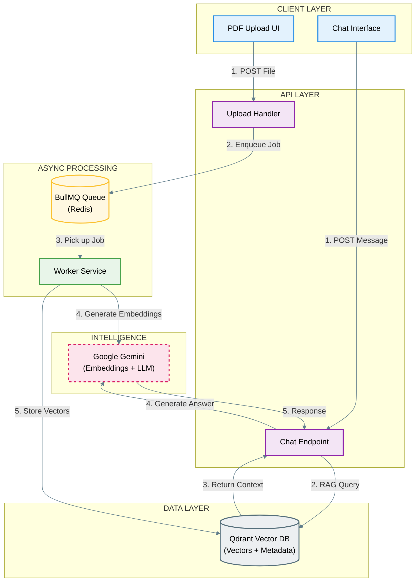
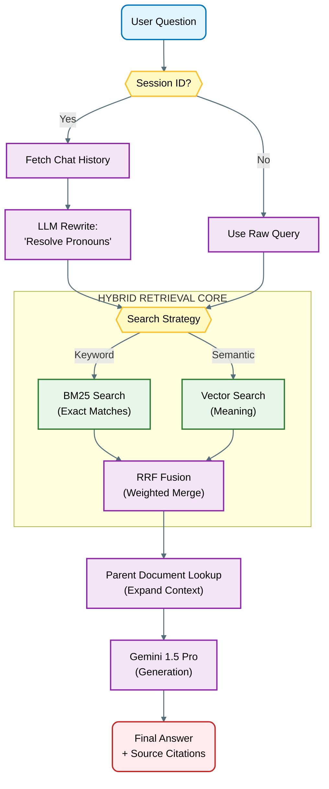
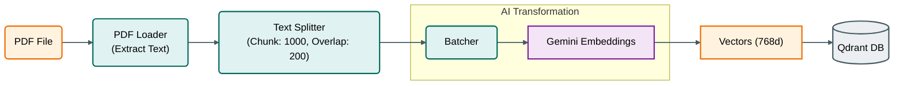

# PromptPage

**A production-grade RAG system that transforms static PDFs into intelligent, conversational knowledge bases.**


## The Problem

Standard RAG implementations face three critical limitations:

1. **Context Loss**: Small chunks optimize for vector search but strip away surrounding context needed for accurate answers.
2. **Search Precision**: Pure semantic search fails on exact matches (product codes, dates, names) while keyword search misses conceptual queries.
3. **Stateless Interactions**: Each question starts from scratch, forcing users to repeat context and making follow-up questions impossible.

Most "PDF chat" applications are simple wrappers around OpenAI's API. They retrieve chunks, stuff them into a prompt, and hope for the best. This project solves the underlying retrieval and context problems that make RAG systems fail in production.

---

## The Solution

PromptPage implements a **three-tier RAG architecture** that addresses each failure mode:

- **Parent Document Retrieval**: Search on small, precise chunks but return large, context-rich parent documents to the LLM.
- **Hybrid Search Pipeline**: Ensemble retriever combining BM25 (keyword) and FAISS (semantic) with configurable weights.
- **Conversational Memory**: Session-aware context management using `RunnableWithMessageHistory` and Redis-backed message stores.
- **Metadata Intelligence**: Self-querying retriever that translates natural language filters into database queries ("Show me Q4 2023 reports").

---

## Tech Stack

### Frontend
- **Next.js 15** (App Router, Server Components)
- **TypeScript** (Strict mode)
- **Tailwind CSS** + **Shadcn/ui** (Design system)
- **Supabase Auth** (OAuth + Email/Password)

### Backend
- **Node.js** (Custom Express server)
- **LangChain** (RAG orchestration)
- **Google Gemini** (Embeddings + LLM)
- **Qdrant** (Vector database)
- **Redis** (Queue + Session store)
- **BullMQ** (Background job processing)

---

## Core Features

### Phase 1: Foundation
These features establish reliable, production-ready document chat:

**Source Attribution**
- Every answer includes citation metadata (page numbers, chunk IDs)
- Users can trace responses back to exact document locations
- Reduces hallucination risk through verifiable sourcing

**Conversational Context**
- Implements `RunnableWithMessageHistory` with session IDs
- Maintains conversation state across multiple turns
- Supports follow-up questions without context repetition
- Example: *"What's the budget?" → "How does that compare to last year?"*

**Document Summarization**
- Automatic summarization on upload using `load_summarize_chain`
- Map-reduce pattern handles documents larger than context windows
- Provides instant document overviews before detailed Q&A

### Phase 2: Advanced Retrieval

**Parent Document Retrieval**

Solves the fundamental RAG tradeoff between search precision and context completeness:
```
Small Chunks (128 tokens) → Vector Search → Retrieve Parent Chunks (512 tokens) → LLM Context
```

- Documents split into small "child" chunks optimized for embedding similarity
- Search executes on children, returns their "parent" chunks to the LLM
- Preserves surrounding context while maintaining search accuracy

**Metadata Filtering (Self-Query Retriever)**
- LLM translates natural language into structured metadata queries
- Supports date ranges, document types, author filters
- Example: *"Financial reports from Q3 2023"* → `{type: 'financial', quarter: 'Q3', year: 2023}`
- Reduces search space and improves relevance

**Hybrid Search (Ensemble Retriever)**

Combines complementary search strategies:

- **BM25**: Keyword-based search for exact matches (SKUs, names, codes)
- **FAISS/Qdrant**: Dense vector search for semantic meaning
- **Configurable weights**: Tune precision vs. recall based on document type
- Default: 40% BM25, 60% vector search

### Phase 3: Agentic & Multimodal (Roadmap)

**Multimodal Document Understanding**
- Uses `unstructured` library to partition PDFs into text, tables, and images
- Separate processing pipelines for each element type
- Vision model (GPT-4V/Gemini) generates descriptions for non-text elements
- All summaries embedded and stored for unified search

**Structured Output Generation**
- Quiz/flashcard generation with JSON schema validation
- Type-safe outputs consumed directly by React components
- Example: Extract key concepts → Generate questions → Render interactive UI

**Agentic RAG (LangGraph)**
- Conditional routing based on retrieval confidence
- If document retrieval fails, redirect query to web search (Tavily API)
- Multi-step reasoning for complex questions requiring external knowledge
- Maintains source attribution across both local and web sources

---

## Architecture

### System Architecture Diagram


**High-Level Flow:**


### RAG Query Pipeline


### Document Processing Pipeline


---

## Installation

### Prerequisites
- Node.js 18+
- Redis (local or cloud)
- Qdrant (Docker recommended)
- Supabase project (for auth)

### Setup

1. **Clone and install dependencies**
```bash
git clone <repository-url>
cd PromptPage
pnpm install
```

2. **Start infrastructure**
```bash
# Start Redis + Qdrant via Docker Compose
docker-compose up -d
```

3. **Configure environment variables**

Create `.env` files in both root and `server/` directories:
```bash
# next-app/.env.local
NEXT_PUBLIC_SUPABASE_URL=your_supabase_url
NEXT_PUBLIC_SUPABASE_PUBLISHABLE_KEY=your_supabase_key

# server/.env
GEMINI_API_KEY=your_gemini_key
GEMINI_API_KEY2=your_backup_key
REDIS_HOST=localhost
REDIS_PORT=6379
REDIS_PASSWORD=ITSMEBBy
QDRANT_URL=http://localhost:6333
```

4. **Initialize Qdrant collection**
```bash
# Create collection via Qdrant dashboard or API
curl -X PUT 'http://localhost:6333/collections/pdf-docs' \
  -H 'Content-Type: application/json' \
  -d '{
    "vectors": {
      "size": 768,
      "distance": "Cosine"
    }
  }'
```

5. **Run development servers**
```bash
# Terminal 1: Next.js frontend
cd next-app
pnpm dev

# Terminal 2: Background worker
cd server
pnpm dev:worker

# Terminal 3: API server
cd server
pnpm dev
```

Access the application at `http://localhost:3000`

---

## Project Structure
```
PromptPage/
├── next-app/                 # Frontend application
│   ├── app/
│   │   ├── (auth)/          # Auth routes (login, signup)
│   │   ├── api/chat/        # Chat endpoint
│   │   └── page.tsx         # Main upload + chat UI
│   ├── components/
│   │   ├── ChatExchange.tsx # Message display
│   │   └── Pdfuploader.tsx  # Dropzone component
│   └── utils/supabase/      # Auth utilities
│
├── server/                   # Backend processing
│   ├── index.js             # Express API server
│   ├── worker.js            # BullMQ PDF processor
│   └── package.json
│
└── docker-compose.yml       # Redis + Qdrant setup
```

---

## Workflow

### Document Upload Pipeline
1. User drops PDF in dropzone
2. File sent to `/upload/pdf` endpoint
3. Job added to BullMQ queue with file path
4. Worker picks up job:
   - Loads PDF with `PDFLoader`
   - Splits into 500-token chunks (50 token overlap)
   - Generates embeddings via Gemini
   - Stores vectors in Qdrant with metadata
5. User receives confirmation

### Chat Pipeline
1. User sends question to `/chat` endpoint with session ID
2. Server retrieves conversation history from in-memory store
3. If history exists, contextualizes question using LLM
4. Hybrid retriever executes:
   - BM25 searches for keyword matches
   - Vector search finds semantic matches
   - Results merged by score
5. Parent document lookup (if enabled)
6. Chunks + history passed to Gemini
7. Response generated with source citations
8. History updated, response streamed to frontend

---

## Future Roadmap

### Q1 2025
- [ ] Multi-document chat (query across entire workspace)
- [ ] OCR support for scanned PDFs (Tesseract integration)
- [ ] Export conversations as markdown
- [ ] Sharing links for specific Q&A sessions

### Q2 2025
- [ ] LangGraph agent implementation (web search fallback)
- [ ] Table extraction and specialized processing
- [ ] Image understanding (GPT-4V/Gemini Vision)
- [ ] Real-time collaboration (multiplayer chat)

### Q3 2025
- [ ] Fine-tuned embedding model for domain-specific docs
- [ ] Custom chunking strategies per document type
- [ ] Analytics dashboard (query patterns, retrieval performance)
- [ ] API access for programmatic document chat

---

## Performance Notes

**Typical Metrics** (tested on 50-page technical PDF):
- Upload processing: ~15-20 seconds
- Query latency: ~2-3 seconds (including LLM generation)
- Memory usage: ~200MB per active session
- Concurrent users: Scales horizontally via BullMQ workers

**Optimization Techniques Used:**
- Lazy loading of LangChain modules
- Persistent Qdrant connections
- Redis-backed session store
- Incremental chunking for large documents

---

## Contributing

This is a portfolio project, but I welcome feedback and suggestions. If you spot bugs or have ideas for improvements, feel free to open an issue.

---

## License

MIT License - See LICENSE file for details

---

## Acknowledgments

Built with:
- [LangChain](https://www.langchain.com/) for RAG orchestration
- [Qdrant](https://qdrant.tech/) for vector storage
- [Supabase](https://supabase.com/) for authentication
- [Vercel](https://vercel.com/) for Next.js tooling

---

**Made by [Your Name]** | [Portfolio](your-link) | [LinkedIn](your-link) | [GitHub](your-link)
